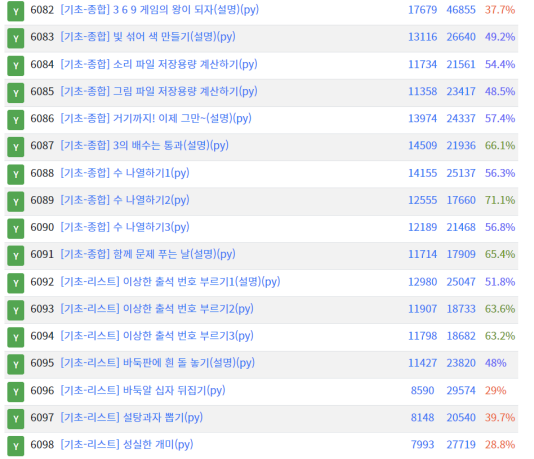

studying python codingTest

1. [코드업 100제](https://codeup.kr/problemsetsol.php?psid=33)

2. 그리디 탐욕법 공부

**이론** - 당장 눈 앞에 있는 최적의 상황만 쫓는 알고리즘으로, 560원 거스름돈을 줄 때, 무조건 더 큰 화폐단위부터 거슬러 준다. 그리디 알고리즘은 정렬 기법이 함께 사용되는 경우가 많으며, 대표적인 예시로 크루스칼 알고리즘이 있다. 

**실전**

3. BFS

4. DFS
